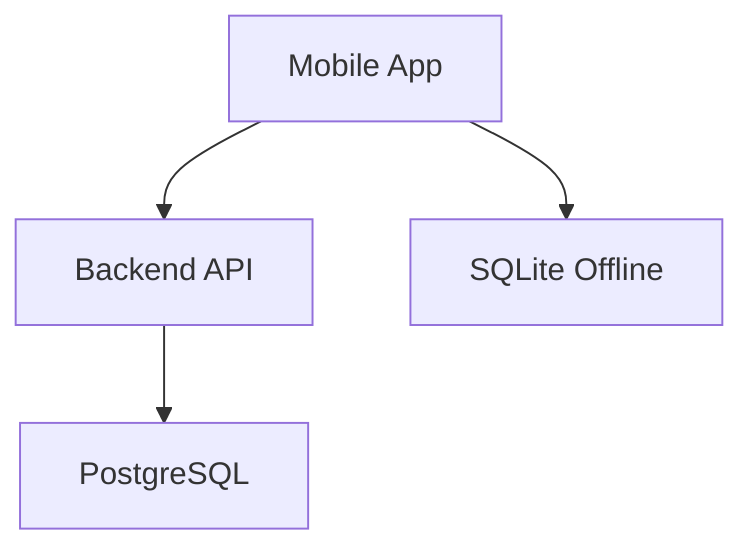

# 🚀 GitHub Setup Guide - Hotfut Coach App

This guide will help you set up your GitHub repository to showcase the Hotfut Coach App professionally.

## 📋 Step-by-Step Setup

### Step 1: Create GitHub Repository

1. Go to [GitHub](https://github.com) and sign in
2. Click **"New repository"** (green button)
3. Repository name: `hotfut-coach-app`
4. Description: `Mobile app for Hotfut Sports coaches to manage attendance, track progress, and create session plans`
5. Choose **Private** or **Public**
6. **Don't** initialize with README (we already have one)
7. Click **"Create repository"**

### Step 2: Push Your Code

```bash
# Navigate to your project folder
cd "C:\Users\91880\OneDrive\Desktop\Sports APP"

# Initialize git (if not already done)
git init

# Add all files
git add .

# Create initial commit
git commit -m "Initial commit: Hotfut Coach App"

# Add remote repository
git remote add origin https://github.com/YOUR_USERNAME/hotfut-coach-app.git

# Push to GitHub
git branch -M main
git push -u origin main
```

**Replace `YOUR_USERNAME` with your GitHub username!**

### Step 3: Enable GitHub Pages

1. Go to your repository on GitHub
2. Click **Settings** (top menu)
3. Scroll down to **Pages** (left sidebar)
4. Under **Source**, select:
   - Branch: `main`
   - Folder: `/docs`
5. Click **Save**
6. Wait 1-2 minutes, then visit: `https://YOUR_USERNAME.github.io/hotfut-coach-app/`

### Step 4: Add Repository Topics

1. Go to your repository main page
2. Click the gear icon next to **About**
3. Add topics:
   - `react-native`
   - `nodejs`
   - `postgresql`
   - `mobile-app`
   - `sports-management`
   - `offline-first`
   - `typescript`

### Step 5: Update README with Your Info

Edit `README.md` and replace:
- `yourusername` with your GitHub username
- Add actual screenshots (when available)
- Update any placeholder links

### Step 6: Add Screenshots (When Ready)

1. Run the app and take screenshots
2. Save to `docs/screenshots/` folder:
   - `login.png`
   - `dashboard.png`
   - `session.png`
3. Update README.md to include them

### Step 7: Create Demo GIF (Optional)

1. Record screen while using the app
2. Convert to GIF using [EZGIF](https://ezgif.com/video-to-gif)
3. Save as `docs/demo/app-demo.gif`
4. Add to README

## 🎨 Repository Features to Enable

### GitHub Actions (CI/CD)

Already set up! The `.github/workflows/ci.yml` file will:
- Run tests on push
- Build the project
- Deploy docs to GitHub Pages

### Issue Templates

Already created! Users can:
- Report bugs using the bug template
- Request features using the feature template

### Pull Request Template

Already created! PRs will automatically include:
- Description section
- Checklist
- Testing instructions

## 📸 Adding Visual Previews

### Option 1: Screenshots in README

```markdown
## 📱 Screenshots

### Login Screen


### Dashboard  

```

### Option 2: Demo GIF

```markdown
## 🎬 Demo


```

### Option 3: Architecture Diagram

Use [Mermaid](https://mermaid.js.org/) in README:

````markdown
## 🏗️ Architecture


````

## 🔗 Quick Links to Add

Update README with:

```markdown
- 📚 [Live Documentation](https://YOUR_USERNAME.github.io/hotfut-coach-app/)
- 🐛 [Report Bug](https://github.com/YOUR_USERNAME/hotfut-coach-app/issues/new?template=bug_report.md)
- 💡 [Request Feature](https://github.com/YOUR_USERNAME/hotfut-coach-app/issues/new?template=feature_request.md)
- 📖 [Full Documentation](./docs/)
```

## ✅ Checklist

- [ ] Repository created on GitHub
- [ ] Code pushed to GitHub
- [ ] GitHub Pages enabled
- [ ] Repository topics added
- [ ] README updated with your username
- [ ] Screenshots added (when available)
- [ ] Demo GIF created (optional)
- [ ] LICENSE file added
- [ ] CONTRIBUTING.md added
- [ ] Issue templates working
- [ ] PR template working

## 🎉 Result

Your GitHub repository will have:

✅ Professional README with badges  
✅ Live documentation on GitHub Pages  
✅ Issue and PR templates  
✅ CI/CD pipeline  
✅ Organized documentation  
✅ Visual previews (when added)  

## 📞 Need Help?

- [GitHub Docs](https://docs.github.com/)
- [GitHub Pages Guide](https://docs.github.com/en/pages)
- [Markdown Guide](https://guides.github.com/features/mastering-markdown/)

---

**Your repository is now ready to showcase! 🚀**

